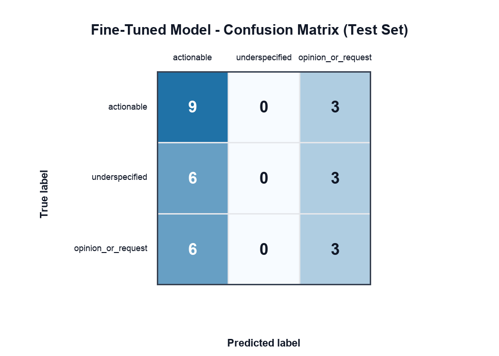

# TakeMeter

CodePath AI201 Project 3: a fine-tuned text classifier for evaluating discourse quality in an online community.

## Project Status

Milestones 1-6 repo deliverables are complete. Community choice, label taxonomy, dataset collection, Colab dataset validation, stratified split, tokenization, DistilBERT fine-tuning, Groq zero-shot baseline evaluation, final comparison artifacts, sample classifications with confidence, and demo recording notes are done. The remaining external step is recording/uploading the 3-5 minute demo video in the Course Portal.

## Community Choice

This project studies the [OpenAI Developer Community](https://community.openai.com/), a public forum where developers discuss OpenAI APIs, models, SDKs, tooling, errors, usage limits, pricing, product feedback, and implementation decisions.

This community is a good fit for TakeMeter because discourse quality has practical consequences: some posts give concrete debugging context or reusable solutions, while others are too vague to act on or are mainly product opinions and feature requests. The classifier will measure the role and usefulness of a post inside a developer conversation.

## 📌 Label Taxonomy

The classifier uses three mutually exclusive labels. The examples below are illustrative examples of the label boundaries, not final dataset rows.

| Label | Definition | Example 1 | Example 2 |
| --- | --- | --- | --- |
| `actionable` | Gives enough concrete information to help someone debug, reproduce, compare, or implement something. This can include code, error messages, configuration details, specific observations, or a workaround. | "The request fails only when `stream=true`; here is the exact Python snippet and 400 response." | "Switching from JSON mode to structured outputs fixed the schema mismatch because..." |
| `underspecified` | Asks for help, reports a problem, or makes a technical claim but lacks enough context to evaluate or respond usefully. | "The API is not working, what do I do?" | "My fine-tune failed again and I have no idea why." |
| `opinion_or_request` | Primarily expresses a preference, complaint, praise, product take, pricing reaction, model comparison, or feature request rather than a concrete technical question or solution. | "The new dashboard is harder to use than the old one." | "OpenAI should add better project-level usage controls." |

## 📌 Data Collection

Examples come from public [OpenAI Developer Community](https://community.openai.com/) forum posts and replies. The labeled dataset is in [`data/openai_developer_community_labeled.csv`](data/openai_developer_community_labeled.csv).

The dataset includes posts about API usage, model behavior, SDKs, tooling, developer workflows, errors, usage limits, pricing, and product feedback. I excluded private account information, copied API keys or secrets, screenshots/images without enough text to label, official documentation pages, category boilerplate, duplicate moderation boilerplate, and consumer-only ChatGPT questions that are not about developer tools or API usage.

Collection was done with [`scripts/collect_openai_forum_dataset.py`](scripts/collect_openai_forum_dataset.py), which uses public Discourse JSON pages, strips HTML, redacts common email/API-key/ID patterns, caps repeated examples from long topics, and creates a balanced 200-row dataset.

## Labeling Process

Each example was labeled by identifying its main role in the developer conversation: actionable technical contribution, underspecified help request/problem report, or opinion/product request.

I used a rubric-assisted labeling script, then spot-checked samples and refined the rules. The main refinements were: category boilerplate was filtered out; screenshots, IDs, code-like text, and exact errors counted as actionable context; conceptual "trying to understand" questions without implementation detail counted as `underspecified`; broad workflow preferences and feature requests counted as `opinion_or_request`.

For mixed posts, I prefer `actionable` if the concrete details are central to the post. Short replies are labeled by purpose: a short reply with a model name or exact error can still be `actionable`, while "same here" is `underspecified` and broad reactions are `opinion_or_request`.

### Label Distribution

| Label | Count | Percent |
| --- | ---: | ---: |
| `actionable` | 80 | 40% |
| `underspecified` | 60 | 30% |
| `opinion_or_request` | 60 | 30% |

### Dataset Split

| Split | Count | Percent |
| --- | ---: | ---: |
| Train | 140 | 70% |
| Validation | 30 | 15% |
| Test | 30 | 15% |

### Difficult Examples

| Text | Final Label | Why It Was Difficult | Decision Rule |
| --- | --- | --- | --- |
| `odc_0019`: asks about `gpt-oss-20b` returning reasoning instead of one-line JSON | `actionable` | It is phrased as a help request, but it gives a model, expected output, observed behavior, and failure pattern. | Concrete technical details beat the fact that it asks for help. |
| `odc_0069`: asks whether Codex Ask helps with game-logic bugs | `underspecified` | It mentions a real workflow, but there is no code, exact bug, error, or reproduction path. | A broad applicability question without technical context is underspecified. |
| `odc_0151`: describes using one model for planning and Codex for execution | `opinion_or_request` | It references an actual workflow, but the main point is personal preference and tool comparison. | Workflow opinions without reproducible details stay `opinion_or_request`. |

## Fine-Tuning Approach

Base model: `distilbert-base-uncased`

Copied Colab notebook: https://colab.research.google.com/drive/15G3bG4fVFzDTiwTDjYdOUVYpOihvv3i5

Milestone 3 prepared the training data in Colab:

- Label map: `actionable -> 0`, `underspecified -> 1`, `opinion_or_request -> 2`
- Dataset source: raw GitHub CSV at `data/openai_developer_community_labeled.csv`
- Validation: 200 examples loaded; all labels matched `LABEL_MAP`
- Split: 140 train, 30 validation, 30 test with stratification by `label_id`
- Tokenizer: `distilbert-base-uncased`, `max_length=256`

The Milestone 3 validation artifact is [`results/milestone3_data_preparation.json`](results/milestone3_data_preparation.json).

Milestone 4 fine-tuned `distilbert-base-uncased` in Colab on a T4 GPU:

- Epochs: 3
- Train batch size: 16
- Evaluation batch size: 32
- Learning rate: `2e-5`
- Weight decay: `0.01`
- Warmup steps: 50
- Best checkpoint selected by validation accuracy

I kept the starter notebook's conservative DistilBERT settings because the dataset is small: 140 training examples, 30 validation examples, and 30 test examples. A `2e-5` learning rate and 3 epochs are reasonable first-pass hyperparameters for avoiding extreme overfitting while still letting the classifier move away from the base model.

The Milestone 4 fine-tuning artifact is [`results/milestone4_finetune_results.json`](results/milestone4_finetune_results.json), and the fine-tuned confusion matrix is [`results/confusion_matrix.png`](results/confusion_matrix.png).

## Zero-Shot Baseline

Baseline model: Groq `llama-3.3-70b-versatile`

Final baseline prompt:

```text
You are classifying posts from the OpenAI Developer Community.
Assign each post to exactly one label based on its main role in the developer conversation.

actionable: The post gives enough concrete information to help someone debug, reproduce, compare, or implement something. It may include code, error messages, steps tried, configuration details, specific observations, or a useful workaround.
underspecified: The post asks for help, reports a problem, or makes a technical claim but lacks enough context to evaluate or respond usefully.
opinion_or_request: The post mainly expresses a preference, complaint, praise, product take, pricing reaction, model comparison, or feature request.

Respond with ONLY one label:
actionable
underspecified
opinion_or_request
```

I ran this prompt in the copied Colab notebook against the same 30-example test split used for the fine-tuned model. The Groq API key was stored as the Colab secret `GROQ_API_KEY` with notebook access enabled; no secret is stored in this repository.

All 30 baseline responses were parseable as one of the three valid labels. The baseline results are saved in [`results/milestone5_baseline_results.json`](results/milestone5_baseline_results.json).

## Evaluation Report

Milestone 5 compares the Groq zero-shot baseline with the fine-tuned DistilBERT classifier on the same 30-example test split. Both models reached 0.400 accuracy, but they made different kinds of mistakes.

### 📌 Metrics

| Model | Accuracy | Notes |
| --- | ---: | --- |
| Zero-shot Groq baseline | 0.400 | 12 correct / 30 test examples; all 30 responses were parseable. |
| Fine-tuned DistilBERT | 0.400 | 12 correct / 30 test examples; never predicted `underspecified`. |

Accuracy tied, so the fine-tuning run did not improve the headline score over the baseline. The baseline was more balanced across labels and recovered some `underspecified` examples, while the fine-tuned model learned a stronger `actionable` signal but collapsed away from the `underspecified` class.

### Per-Class Metrics

| Model | Label | Precision | Recall | F1 |
| --- | --- | ---: | ---: | ---: |
| Zero-shot Groq baseline | `actionable` | 0.40 | 0.33 | 0.36 |
| Zero-shot Groq baseline | `underspecified` | 0.38 | 0.56 | 0.45 |
| Zero-shot Groq baseline | `opinion_or_request` | 0.43 | 0.33 | 0.38 |
| Fine-tuned DistilBERT | `actionable` | 0.43 | 0.75 | 0.55 |
| Fine-tuned DistilBERT | `underspecified` | 0.00 | 0.00 | 0.00 |
| Fine-tuned DistilBERT | `opinion_or_request` | 0.33 | 0.33 | 0.33 |

The baseline macro F1 was 0.40 and weighted F1 was 0.39. The fine-tuned model's macro F1 was 0.29 and weighted F1 was 0.32. Even though accuracy tied, the baseline had better class balance on this small test set.

### 📌 Confusion Matrix

Rows are true labels. Columns are predicted labels.

| True \ Predicted | `actionable` | `underspecified` | `opinion_or_request` |
| --- | ---: | ---: | ---: |
| `actionable` | 9 | 0 | 3 |
| `underspecified` | 6 | 0 | 3 |
| `opinion_or_request` | 6 | 0 | 3 |



### Wrong Predictions

| Text | True Label | Predicted Label | Why It Failed |
| --- | --- | --- | --- |
| "Livestream ... Sam Altman ... Really excited." | `actionable` | `opinion_or_request` | The short announcement-like text reads like community reaction even though the event details make it actionable. |
| "Seems the prompt caching is broken..." | `underspecified` | `opinion_or_request` | It complains about a technical issue but lacks enough reproduction details; the model treated the complaint tone as the main signal. |
| "I'm new to using AI for my small business..." | `opinion_or_request` | `actionable` | The post asks for practical direction, so the model over-weighted the help-seeking wording instead of the broad request style. |

### 📌 Sample Classifications

For Milestone 6, I exported five test-set examples with fine-tuned DistilBERT labels and softmax confidence scores using [`scripts/export_milestone6_samples.py`](scripts/export_milestone6_samples.py). Because the original Colab model checkpoint was not committed, this script reruns the same committed train/validation/test split and DistilBERT hyperparameters to produce the demo confidence table. The aggregate comparison above remains the official Colab evaluation result.

| ID | Short Text | True Label | Predicted Label | Confidence | Result / Notes |
| --- | --- | --- | --- | ---: | --- |
| `odc_0021` | "As per the MCP specification for tool discovery and pagination..." | `actionable` | `actionable` | 0.358 | Correct. The post names a specific MCP pagination behavior, expected spec behavior, and observed failure. |
| `odc_0053` | "In the blog post for gpt-realtime there are primitive examples..." | `underspecified` | `actionable` | 0.364 | Incorrect. Documentation links and dates look concrete, but the label treats the post as missing enough implementation context. |
| `odc_0084` | "From idea to working product in a few weeks. I built an AI-native email layer..." | `actionable` | `actionable` | 0.356 | Correct. The post gives concrete product behavior, constraints, and feedback targets. |
| `❗️odc_0111` | "I've been experimenting with multi-step AI prompting techniques..." | `opinion_or_request` | `actionable` | 0.370 | Incorrect. The model over-weighted structured technical wording even though the post is mainly a broad method proposal. |
| `odc_0129` | "The Future of Email Should Belong to OpenAI. Here's the blueprint..." | `actionable` | `actionable` | 0.364 | Correct under this project's rubric because the post gives a concrete product blueprint, not only a preference. |

The confidence scores are all low, which matches the broader evaluation: the model is not strongly calibrated and is often uncertain even when it predicts the right label.

## Reflection

The label taxonomy was meant to separate conversational function: concrete technical usefulness, vague help-seeking, and product opinion or feature request. The zero-shot baseline followed those definitions fairly evenly, especially for `underspecified`, because the prompt explicitly described missing context as the key signal.

The fine-tuned DistilBERT model learned some useful surface cues for `actionable`, such as model names, technical terms, and implementation-like language. Its main failure was the `underspecified` boundary: on this run, it never predicted that class. That suggests the small training set did not give the model enough stable examples of vague technical help requests, or the wording overlap between `underspecified` and the other labels was too high for a first-pass DistilBERT run.

## Spec Reflection

The project spec helped by forcing a clean baseline-versus-fine-tuned comparison on the same test split. Without that constraint, the 0.400 fine-tuned accuracy might look like the only result; with the baseline, it is clearer that the fine-tuned model did not beat a carefully prompted LLM and needs more data or training iteration.

One implementation detail I handled carefully was secret management. Instead of pasting the Groq API key into the notebook or repo, I used Colab Secrets with notebook access enabled. The tradeoff is that the repo documents the baseline results and artifacts, but it does not contain any runnable secret.

## AI Usage

| Task | What I Asked AI To Do | What It Produced | What I Changed |
| --- | --- | --- | --- |
| Project setup | Scaffold the repository and documentation sections from the CodePath checklist. | Initial README, planning file, folders, and git setup. | Accepted the scaffold and kept TODOs for data/model results. |
| Milestone 1 planning | Suggest OpenAI-related communities and label options, then fill Milestone 1. | Selected OpenAI Developer Community and drafted the 3-label taxonomy. | Accepted the community and labels; will revise after reading the first 30-40 examples if needed. |
| Milestone 2 data | Collect public forum examples and create a labeled dataset using the Milestone 1 taxonomy. | A reproducible collector script, 200-row CSV, balanced label distribution, and split metadata. | Refined the labeling rules after spot checks; filtered boilerplate and redacted common sensitive patterns. |
| Milestone 3 preparation | Configure the Colab notebook for the project dataset and run the validation, split, and tokenization cells. | Label map, GitHub CSV path, validated data counts, stratified split, tokenizer output, and a JSON proof artifact. | Verified Colab outputs and kept fine-tuning/baseline cells for later milestones. |
| Milestone 4 fine-tuning | Reconnect Colab, train DistilBERT, evaluate on the test split, and document the result. | A completed fine-tuning run, test metrics, confusion matrix, and repo artifacts. | Kept the first-pass run, documented the `underspecified` failure mode, and left Groq baseline comparison for the next milestone. |
| Milestone 5 baseline | Run the Groq zero-shot baseline, compare it with the fine-tuned model, and update the report artifacts. | Baseline metrics, side-by-side comparison, and final evaluation JSON files. | Documented the tie in accuracy and highlighted that the baseline had better class balance. |
| Milestone 6 final report | Surface final error patterns, add sample classifications with confidence, and prepare demo materials. | A sample-confidence export script, Milestone 6 JSON artifact, final README polish, and a demo script. | Kept the original Colab metrics as the official comparison and used the rerun only for sample confidence examples. |

## Demo Video

The required 3-5 minute demo video should show 3-5 classifications with label and confidence, one correct prediction, one incorrect prediction, and a brief walkthrough of the evaluation report. I prepared [`demo_script.md`](demo_script.md) with the exact flow and narration points to use while recording.

## 📌 Stretch Features

### Confidence Calibration

I added a calibration analysis to [`results/milestone6_sample_classifications.json`](results/milestone6_sample_classifications.json). This analysis uses the Milestone 6 local DistilBERT rerun because the original Colab checkpoint was not committed.

| Confidence Group | Count | Avg. Confidence | Accuracy |
| --- | ---: | ---: | ---: |
| Fixed bin `0.00-0.40` | 30 | 0.350 | 0.467 |
| Lowest confidence third | 10 | 0.343 | 0.400 |
| Middle confidence third | 10 | 0.350 | 0.400 |
| Highest confidence third | 10 | 0.358 | 0.600 |

The model's confidence values are tightly compressed: every test prediction landed below 0.40 confidence. The highest-confidence third was more accurate than the lower two thirds, but the difference is small and the range is narrow. I would not treat these scores as well-calibrated probabilities; they are better read as weak relative confidence signals.

### Error Pattern Analysis

The main systematic error is over-predicting `actionable` and failing to learn `underspecified`. In the official Colab evaluation, the fine-tuned model never predicted `underspecified`. All 9 true `underspecified` test examples were misclassified: 6 as `actionable` and 3 as `opinion_or_request`.

The broader pattern is that technical-looking language pulls the model toward `actionable`, even when the post is missing enough context or is mainly a broad proposal. Across the 18 wrong predictions in the fine-tuned confusion matrix, 12 were false `actionable` predictions. This points to a feature-learning problem: DistilBERT appears to be using surface cues like API terms, product names, structured steps, and implementation vocabulary rather than reliably learning the intended discourse function.

To improve this, I would add more hard negative examples where posts mention technical tools but should still be `underspecified` or `opinion_or_request`, then retrain with class weighting or a sampling strategy that forces the model to see the `underspecified` boundary more often.

### Deployed Interface

I added a small local browser interface in [`src/takemeter_app.py`](src/takemeter_app.py). It accepts a new post, predicts a label, and displays a confidence score plus per-label probabilities.

Run it from the repo root:

```bash
python3 src/takemeter_app.py --port 8765
```

Then open:

```text
http://127.0.0.1:8765
```

The interface trains a lightweight TF-IDF logistic regression classifier on the committed training split at startup. I used this because the full DistilBERT checkpoint is too large to commit cleanly, while the stretch rubric accepts source showing a working interface.

Sample API transcript:

```bash
curl -sS -X POST http://127.0.0.1:8765/api/classify \
  -H 'Content-Type: application/json' \
  -d '{"post":"The request fails only when stream=true using the Python SDK. Here is the exact 400 error and the snippet that reproduces it."}'
```

```json
{
  "label": "actionable",
  "confidence": 0.431,
  "probabilities": {
    "actionable": 0.431,
    "underspecified": 0.295,
    "opinion_or_request": 0.274
  },
  "mode": "tfidf_logistic_regression"
}
```

### Inter-Annotator Reliability

I prepared the support files for this stretch, but I am not claiming the point yet because the rubric requires 30+ examples labeled independently by two people. I cannot truthfully invent a second human annotator.

Prepared files:

- [`data/inter_annotator_sample.csv`](data/inter_annotator_sample.csv): 30 validation examples with `labeler_a_label` filled and `labeler_b_label` left blank.
- [`scripts/analyze_inter_annotator.py`](scripts/analyze_inter_annotator.py): computes percentage agreement, Cohen's kappa, label distributions, and disagreement rows after a second person fills in `labeler_b_label`.

Once a second human labels the worksheet, run:

```bash
python3 scripts/analyze_inter_annotator.py
```

## Repository Structure

```text
.
├── demo_script.md
├── README.md
├── planning.md
├── data/
│   ├── inter_annotator_sample.csv
│   └── openai_developer_community_labeled.csv
├── notebooks/
├── results/
│   ├── confusion_matrix.png
│   ├── evaluation_results.json
│   ├── milestone3_data_preparation.json
│   ├── milestone4_finetune_results.json
│   ├── milestone5_baseline_results.json
│   └── milestone6_sample_classifications.json
├── scripts/
│   ├── analyze_inter_annotator.py
│   ├── collect_openai_forum_dataset.py
│   ├── export_milestone6_samples.py
│   └── prepare_inter_annotator_sample.py
└── src/
    └── takemeter_app.py
```

## How to Run

Use the copied Colab notebook:
https://colab.research.google.com/drive/15G3bG4fVFzDTiwTDjYdOUVYpOihvv3i5

For Milestones 3-5 reproduction:

1. Open the copied Colab notebook and use a T4 GPU runtime.
2. Confirm the Colab secret `GROQ_API_KEY` exists with notebook access enabled for later baseline cells.
3. Run the setup/import cells.
4. Use the `LABEL_MAP` shown above.
5. Set `CSV_PATH` to the raw GitHub CSV URL.
6. Run Sections 1-2 through tokenization.
7. Run Section 3 to load and fine-tune `distilbert-base-uncased`.
8. Run Section 4 to evaluate on the test set and save `confusion_matrix.png`.
9. Run the Groq baseline section with `llama-3.3-70b-versatile`.
10. Run the comparison/export section to generate `evaluation_results.json` and the final side-by-side metrics.

For the Milestone 6 sample-confidence table, run this local utility from the repo root:

```bash
python3 scripts/export_milestone6_samples.py
```

It recreates the committed split, fine-tunes `distilbert-base-uncased` with the same small-run hyperparameters, and writes [`results/milestone6_sample_classifications.json`](results/milestone6_sample_classifications.json).

For the stretch interface:

```bash
python3 src/takemeter_app.py --port 8765
```

For the inter-annotator worksheet:

```bash
python3 scripts/prepare_inter_annotator_sample.py
python3 scripts/analyze_inter_annotator.py
```
